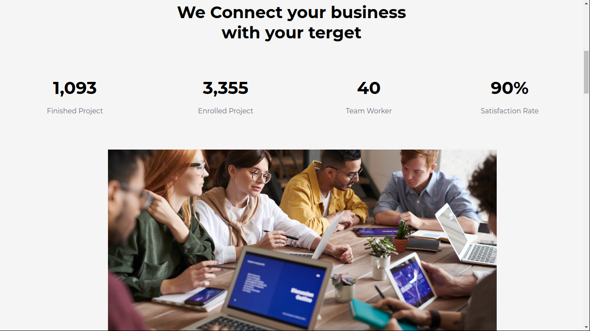
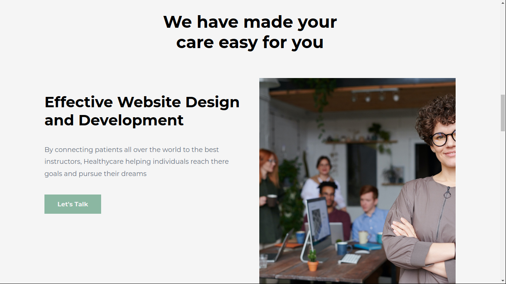
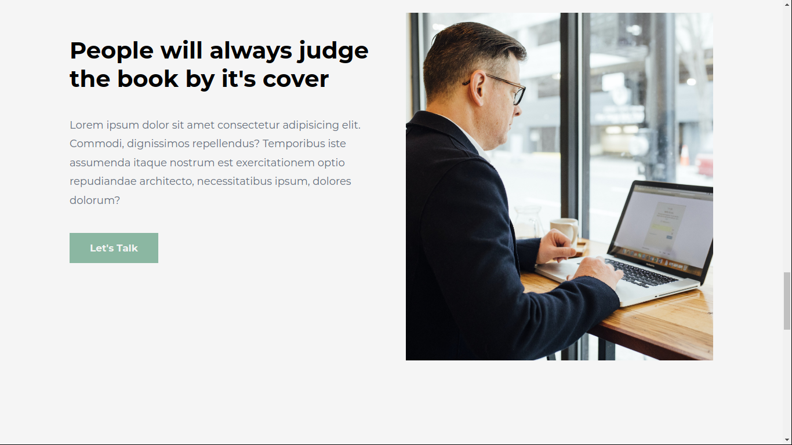
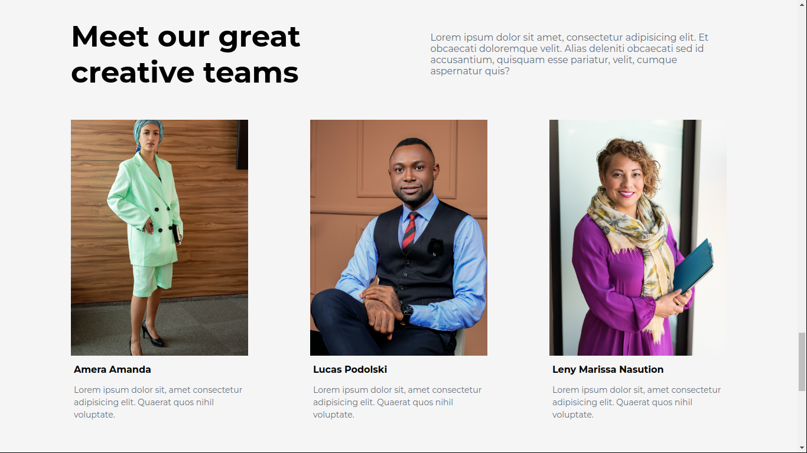
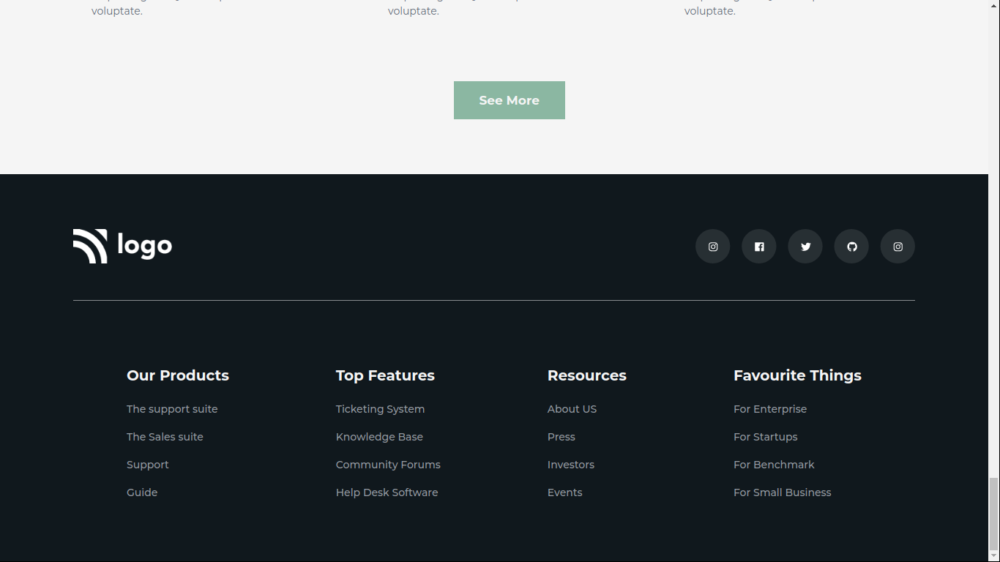

# Assignment 12
11th August 2022
## Full Stack Javascript Web Development Course by [iNeuron](https://ineuron.ai/)

This website is created with HTML and CSS only. It is not fully mobile responsive. I will update this project very soon to make it mobile responsive. It took me almost 8 hours to complete this project.This project helped me to learn planning for designing a long web page, deviding the HTML in parts to make it easier and more customizable, writing HTML in a more organized process. Images and icons are collected from [icons8](https://icons8.com/) and [iNeuron](https://ineuron.ai/).

[Click Here](https://fsjs-assignment12.netlify.app/) to view the website.

### Screenshot of the full web-page:

### Screenshots of different parts of the webpage:

       

## Contact me: [Linkedin](https://www.linkedin.com/in/subham-dutta-8670b8178/) | [Github](https://github.com/Sduttt) | [Twitter](https://twitter.com/Subhamd88404337) | [Facebook](https://www.facebook.com/profile.php?id=100073951804006) | [Instagram](https://www.instagram.com/its_subham_dutta/)

## Find me on [Findcoder.io](https://www.findcoder.io/u/sdutta)